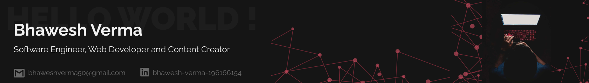

___
## **Hey There Amigo! Welcome to my Github Profile **

I am a **Creative developer proficient in making minimal webpages and apps**. Mostly I work on backend but also has a very good knowledge of Frontend and animations.
You can *check out my works from the repository pinned below* and if that intrests you, you can always dig deeper.
 

* 🔭 I’m currently working on Some fun projects mentioned below.
* 🌱 I’m currently learning more about DevSecOps.
* 👯 I’m looking to collaborate on some cool project ideas I * have.
* 💬 Ask me about anything related to technology or Games.
* 📫 How to reach me: Just click on any of the badge above.
* ⚡ Fun fact: I am into singing and writing poems too.

### **Currently Working on 👩‍💻:**

* **GIFairy :** It is a discord bot (made using discord.js) used for sending GIFs all across the server.

* **Battery Utilities :** It is a python program which runs continously in background and looks for your laptops battery health.

* **EyeTracker Utilities :** The coolest eyetracking playground out there with IBrush, ZenI Mode, etc.
 
 
 

<!--   

&nbsp;&nbsp;&nbsp;&nbsp;
&nbsp;&nbsp;&nbsp;&nbsp;
&nbsp;&nbsp;&nbsp;&nbsp;
&nbsp;&nbsp;&nbsp;&nbsp;
&nbsp;&nbsp;&nbsp;&nbsp;
&nbsp;&nbsp;&nbsp;&nbsp;
&nbsp;&nbsp;&nbsp;&nbsp;
&nbsp;&nbsp;&nbsp;&nbsp;
&nbsp;&nbsp;&nbsp;&nbsp;
&nbsp;&nbsp;&nbsp;&nbsp;
&nbsp;&nbsp;&nbsp;&nbsp;
&nbsp;&nbsp;&nbsp;&nbsp;
&nbsp;&nbsp;&nbsp;&nbsp;
&nbsp;&nbsp;&nbsp;&nbsp;
&nbsp;&nbsp;&nbsp;&nbsp; -->

